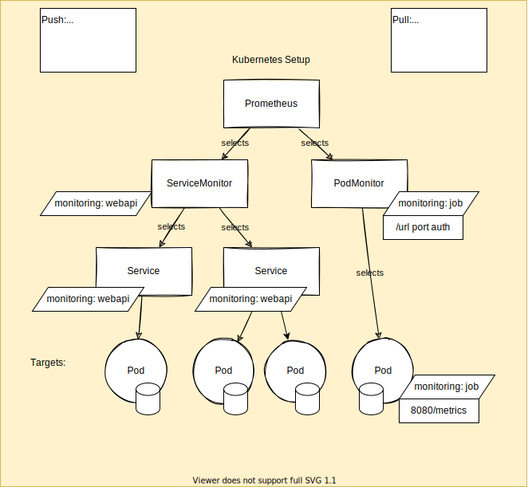

# Igredients for a Prometheus Kube Stack Setup

1. Services that expose prometheus compatible metrics
2. ServiceMonitor that collects metrics from the services
3. Prometheus manifest that refers to the service monitors

